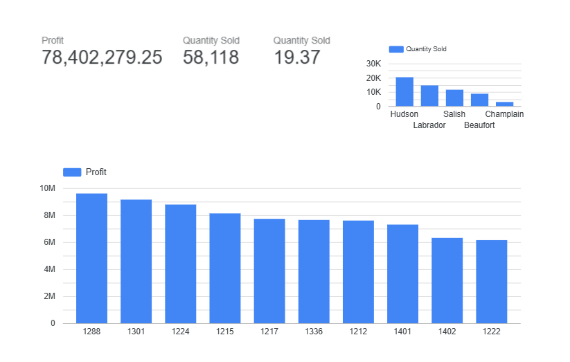

# Sales-and-Service-Dashboard
Interactive Looker Studio dashboard analyzing company Sales and Service performance, highlighting KPIs for profit, quantity sold, and service efficiency
### Tools Used
- Google Looker Studio (formerly Data Studio)
- Google Sheets (data preparation)

### 📊 Page 1 – Sales Dashboard
**KPIs:** Profit, Quantity Sold, Dealer Performance  
**Visuals:** Bar chart by dealer ID, quantity trend, and profit analysis  
**Insights:**
- Total Profit: $78M+
- Top regions: Hudson and Labrador
- Gradual decline in profit after February due to seasonal demand drop

---

### ⚙️ Page 2 – Service Dashboard
**KPIs:** Units Serviced, Systems Affected (Airbag, Seats, Suspension), Sentiment Analysis  
**Visuals:** Heatmap of issues by model, sentiment treemap, bar charts  
**Insights:**
- Positive feedback dominates service interactions
- Champlain and Beaufort models had the most service activity
- Airbag and Suspension systems generated the highest service volume

---

### Skills Demonstrated
- Data visualization & dashboard storytelling
- Multi-page analysis design in Looker Studio
- Business KPI development
- Insight generation using real-world datasets

---

**View Live Dashboard:** [(https://lookerstudio.google.com/s/p4KU3R2Uiqo)]
